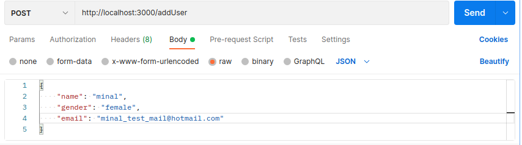
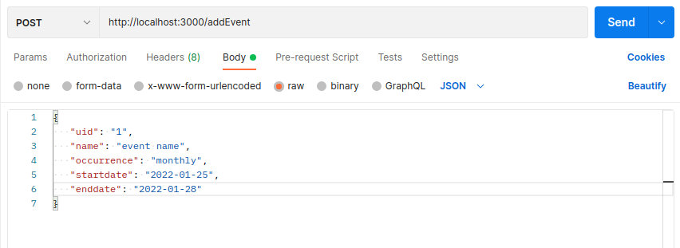

# AVTAAR Assignment two

**Assignment outcome:**
Create a REST API for the following
- Add a user
- Add event for a user

For this assignment I used
- NodeJS (ExpressJS)
- PostgreSQL

This REST API has two mandatory and two extra end points, using which user can add and view users and events.

> localhost:3000/addUser

> {
>   "name": "user name",
>   "gender": "gender",
>   "email": "user email address"
> }

  Using this end point user can add a new user with all the required parameters, use POST request.
  
> localhost:3000/addEvent

> {
>   "uid": "uid of the user to who the event belongs",
>   "name": "event name",
>   "occurrence": "weekly/monthly/yearly",
>   "startdate": "date",
>   "enddate": "date"
> }

using this end point user can add a new event with all the required parameters, use POST request.

### This two end point listed below is bonus to this assignment to fetch all the users and events.

> localhost:3000/getUsers

> locahost:3000/getEvents

### Output/Screenshot

## Instruction to run this program
User must have a docker-engine running on his/her machine, just copy and past below code to run this project.

> sudo docker create -i --name=assign-two -p 3000:3000 bumze/avtaar:assignment-two

This command will create a container with **assign-two** name, and map the host and container post no 3000, i is for interactivity with this container.
  
> sudo docker start assign-two

This command will start initially created container.
  
> sudo docker exec assign-two pg_ctlcluster 12 main start

This command will start PostgreSQL database server in the container.

> sudo docker exec assign-two node /home/assignment-2/index.js

This command will start express server on port 3000.

**Congratulations** your server is up and ready to accept requests on **localhost:3000**

## What did I learned

this assignment was a challenging one for me, I learned a lot of new skills including
- building express server
- postgreSQL to node environment connectivity
- contanarizing a whole program using docker
- publishing a docker image

## Known issue

while building this project I get to know some issues which can be resolved
- Default timezone is not IST in postgreSQL
- user can input any uid in event irrespective of user table
- docker image size is big(approx 1GB), need optimization
