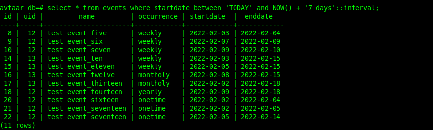

# Avtaar assignment 3

### DB Queries

- Query to create the user table.

> create table users(
	uid serial primary key,
	name varchar(55) not null,
	gender varchar(15),
	email varchar(251) unique not null
	);

- Query to create the event table.

> create table events(
	id serial primary key,
	uid int,
	name varchar(51),
	occurrence varchar(51) not null,
	startdate date not null,
	enddate date,
	FOREIGN KEY(uid)
	REFERENCES users(uid));

### Before we move forward have a look at both tables.

- Query to insert into Users table.

> insert into users(name, gender, email) values('hitesh', 'male', 'hbhatiwork@gmail.com');

- Query to get all events for today(both yearly and onetime).

> select * from events where occurrence = 'yearly' or occurrence = 'onetime' and startdate = '2022-01-31';

- Query to get all users for a list of uid, users whose uid is one of (1, 2, 6, 8, 9).

> select * from users where uid = 1 or uid = 2 or uid = 6 or uid = 8 or uid = 9;

- Query to get all events for a uid(eg. get all events for uid = 1).

> select * from events where uid = 1;

- Query to get all events for the next 7 days.

> select * from events where startdate between now() and now() + '7 days'::interval;

### What did I learned in this assignment

how to use DATE() function and fetch data of a specific interval.